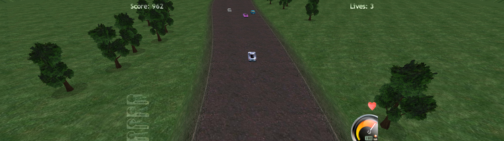

# Highway Pursuit Modern Display Patcher

A source-available display compatibility patcher for the free PC game **Highway Pursuit**.

**Original game / official game page:**  
https://adamdawes.com/games/highway-pursuit.html

  

This project patches the user's existing `HighwayPursuit.exe`. No original game executable or game assets are distributed by this repository.

## What the patch adds

The patched game keeps the original resolutions and adds modern display modes:

- 640x480
- 800x600
- 1024x768
- 1280x960
- 1920x1080
- 2160x1440
- 3840x2160
- 5120x1440

It also includes:

- Borderless fullscreen using the game's windowed Direct3D 8 path
- DPI-aware window positioning, including Windows display scaling such as 125%
- Ultrawide HUD positioning centered around a 16:9 safe area
- Alt-Tab friendly behavior
- Automatic exact backup of the executable before patching
- Safe compatibility checks at every location that will actually be modified

## Installation / one-click source build

1. Install or extract Highway Pursuit from the original game page above.
2. On this GitHub repository choose **Code -> Download ZIP**, or download GitHub's automatic **Source code (zip)** from a release.
3. Extract the source ZIP to a normal folder.
4. Double-click `build.bat`.
5. On the first run, `build.bat` downloads the official portable Go toolchain from `https://go.dev/dl/`, verifies its SHA-256 checksum and extracts it only into the local `tools` folder.
6. The script runs the tests and builds:

   `dist\HighwayPursuit-Ultrawide-Patcher.exe`

7. Copy that EXE into the Highway Pursuit game folder, next to the original `HighwayPursuit.exe`.
8. Make sure the game is closed and run `HighwayPursuit-Ultrawide-Patcher.exe`.
9. Confirm the patch when prompted.
10. Start the game and select the desired resolution in **Options -> Graphics options**.

The portable Go toolchain is not installed system-wide, does not require administrator rights and can be removed simply by deleting the source folder's `tools` directory.

### What `build.bat` downloads

The Windows build script is deliberately pinned to one official Go archive rather than downloading an unspecified latest version:

- Go: `1.27.1`
- Archive: `go1.27.1.windows-amd64.zip`
- Source: `https://go.dev/dl/go1.27.1.windows-amd64.zip`
- Expected SHA-256: `a3911b5e0e1b1053f25ed0675f4c1c6aad1e2bfcf253df2b9be4caabd2edd95d`

If the checksum does not match, the archive is not extracted and the build stops.

## Antivirus note

This program modifies another Windows executable by design. That behavior, combined with a new unsigned executable having little or no reputation, can trigger heuristic antivirus detections even when built from this source.

Building locally avoids browsers blocking a pre-built binary download, but it cannot guarantee that every antivirus product will accept the resulting EXE. Do not disable antivirus protection to run the patcher. The source and patch data are included so the behavior can be reviewed before building.

## GitHub releases

The repository intentionally does **not** upload a pre-built patcher executable.

When a GitHub Release is published, GitHub automatically provides **Source code (zip)** and **Source code (tar.gz)**. Windows users can download the source ZIP, extract it and run `build.bat`.

The included GitHub Actions workflow only tests the source and verifies that the Windows executable can be built. It does not attach a binary to the release.

## License and disclaimer

The patcher source is released under the MIT License. Highway Pursuit itself is not included and is not covered by this license.

This is an unofficial fan-made compatibility/display patch and is not affiliated with the original game author or publishers.
